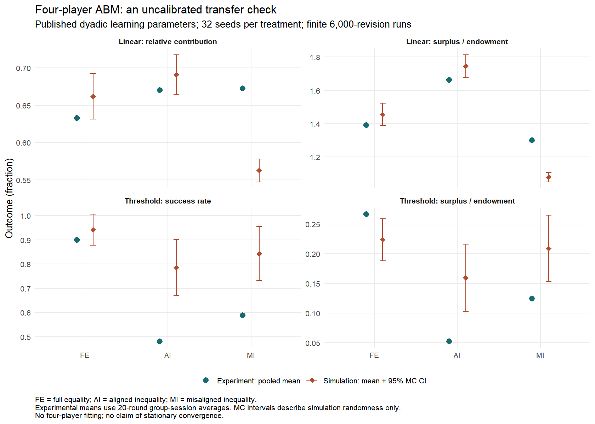

# Four-player ABM MVP 结果与核对说明

2026-09-07。六个 treatment 的 MVP 已实现并运行；规则层 verification 通过，行为层 validation 显示明显偏差与初始化依赖。因此当前成果适合用于代码学习、模型诊断和诚实的 portfolio 展示，不能声称已验证四人合作机制或完成稳态估计。

## 已完成的工作

四人 game engine、同时行动、relative-contribution group signal、reactive strategy、完整反事实 episode、introspection-style revision、六组多 seed 模拟、tidy CSV、真实实验数据比较、独立手算/时序/边界/重现测试、R 分析与图形均已完成。

主模拟：每个 treatment 32 个独立 seed，6,000 次 revision，前 2,000 次作为 warm-up 排除。每次 episode 为 20 rounds。主要均值使用剩余全部 4,000 个策略状态；每隔 100 次另存一段完整 episode，供逐行核对和 R 轨迹图使用。总计 192 条独立主链，614,400 条 agent-round snapshot，153,600 条 group-round snapshot。snapshot 数量不是独立样本量。

六个预先定义的敏感性变体每组各 16 个 seed：13→25 个 signal levels、mean→minimum signal、全零初始化、全额贡献初始化、运行加长至 12,000 次并保留最后 4,000 次、关闭 fairness。它们用于发现问题，没有按四人实验拟合优度挑选“最佳模型”。

## 来源和设定边界

理论来源为 Wang, Hilbe & Zhang (2026), [PNAS 论文](https://doi.org/10.1073/pnas.2525760123) 与公开补充材料；数据和原作者 MATLAB 代码来自 [Zenodo 16918146](https://doi.org/10.5281/zenodo.16918146)。具体来源、校验和、版本及设定见 [source_manifest.json](reference/source_manifest.json) 与 [MODEL_SPEC.md](docs/MODEL_SPEC.md)。用户提到的上传 PDF 在当前 Windows 镜像中不可访问，因此核对的是作者公开最终版及同文 SI，未声称与上传文件逐字节相同。

**论文已有设定：** Table S15 的六套 endowment/productivity/threshold/reward、整数 contribution、20-round episode、两人 reactive strategy 与 introspection 机制。四人 threshold 参数核实为 FE=48、AI=120、MI=72，成功后每人 reward=20。SI p.13 报告的两人最优 (s,β,γ) 分别为 linear (1,0,14)、threshold (1,18,94)。作者公开脚本中的演示默认值并非这些最优值。

**本次 extension assumptions：** 对其他三人上一轮 c/e 取不加权均值，以 13 个信号点查询反应；公平惩罚是对其他三人平均两两绝对/相对差异；两人估计的 preference weights 原样迁移；每次在四人中均匀随机选一人修订整条策略；组成员固定、不模拟第二个实验 session 的重组或角色互换。均值信号不同于 SI Fig. S23 分析的人类对其他人有效贡献的反应。

## 主结果：模型的偏差在哪里

以下为真实数据重新计算的 pooled group-session 均值与主模拟的 across-seed 均值。完整 95% Monte Carlo 区间、seed dispersion、session 1 / session 2 分开结果见 [comparison.csv](output/comparison.csv)。

| Game / treatment | 指标 | 实验 | 模拟 |
|---|---|---:|---:|
| Linear FE | Group relative contribution | 63.3% | 66.2% |
| Linear AI | Group relative contribution | 67.0% | 69.1% |
| Linear MI | Group relative contribution | 67.3% | 56.3% |
| Threshold FE | Success rate | 90.0% | 94.2% |
| Threshold AI | Success rate | 48.0% | 78.6% |
| Threshold MI | Success rate | 58.8% | 84.3% |

| Game / treatment | 实验 surplus | 模拟 surplus |
|---|---:|---:|
| Linear FE | 1.392 | 1.456 |
| Linear AI | 1.663 | 1.746 |
| Linear MI | 1.301 | 1.079 |
| Threshold FE | 0.267 | 0.224 |
| Threshold AI | 0.052 | 0.159 |
| Threshold MI | 0.124 | 0.209 |

Surplus 定义为 (group total monetary payoff − group endowment) / group endowment；它可大于 1。成功率只适用于 threshold。

Linear 中，模拟保留了 AI surplus 高于 MI 的排序，但低估 MI contribution 约 **11.0 个百分点**，未能重现四人实验中 AI 与 MI 的接近贡献水平。Threshold 中，模拟高估 AI 和 MI 的成功率约 **30.6、25.5 个百分点**，同时高估二者的 surplus。相同的 surplus 排序不足以证明解释了人类行为。

20-round trajectory 也存在偏差：模拟的固定策略 episode 往往迅速上升后趋于平缓；实验 linear contribution 在末轮下降。当前 reactive lookup 没有 round index 或 end-game anticipation，不能期待它自动解释所有末轮变化。图见 [round_trajectories.png](output/figures/round_trajectories.png)；这张图的 round 与学习过程的 revision step 是不同的时间轴。

## 敏感性揭示的关键限制

**初始化依赖很强。** 从全零策略开始的 16-seed threshold 检查，在保留区间内三个 treatment 的平均成功率均为 0；从全额贡献策略开始，FE 平均成功率约 99.7%，但 surplus 约 −0.125，反映过量贡献的成本。因此“成功达到门槛”和“产生高 surplus”必须分开。

**加长运行没有建立稳态证据。** 12,000-step random-initialization 检查中，MI threshold 成功率约 96.5%，surplus 约 0.269；这仍明显偏离实验。较长运行只检验了一个更晚的有限区间，没有证明混合充分，更没有消除零初始化与全额初始化的差异。主文使用 10^7 steps，本 MVP 的计算预算远小于原文。

**信号粒度与机制设定需要继续审核。** 25 levels 改变了部分估计，但没有消除 MI linear 的贡献偏低；minimum signal 和 no-fairness 对照一起保留在 [sensitivity_summary.csv](output/sensitivity_summary.csv)。同一前 16 个 seed 的配对差异及 join 审核见 [sensitivity_paired_differences.csv](output/sensitivity_paired_differences.csv)。不能从这些诊断中事后挑一个最贴近实验的结果，称为完成 validation。

主结果用每个 post-warm-up 状态的平均数；稀疏 snapshot 的跨链均值与全状态均值差异最大约 contribution 0.00269、surplus 0.00592、success 0.00284。保留两种统计量使 thinning 的影响可检查。

## 数据、verification 和不确定性

- 公开 linear MAT 转换后的 CSV 与原仓库 12,480×7 CSV 逐格相同，SHA-256 也一致。Threshold 数据为 11,040×7。两个数据集均没有缺失值、重复 player-round key 或不完整四人组；没有删除观测。
- 实验数据汇总为 linear 156、threshold 138 个 group-session，六组主要均值与 SI pp.16、18 一致到原文的报告精度。组键使用 Treatment + Session + GroupID，因为实际数据的 GroupID 跨 treatment 重复。GlobalPlayerID 是 participant-session ID，无法还原同一人跨 session 的联系。
- **17 项测试通过**：含独立 scalar payoff/episode/完整 revision-chain 参照、零/满额/门槛等号、越界和非整数拒绝、公平惩罚退化至两人 Eq.4、随机 seed 重现、单链与批处理一致、全部 24 种遍历顺序、玩家重新编号、故意错误的 sequential 负面对照和全组反事实响应。
- 主模拟六组 CSV 全部重新读取：核对哈希、键唯一性、四人 roster、行数、endowment/productivity、重新计算每一条 payoff 与 utility，以及 agent/group 汇总与一对一 join 的 100% 匹配。详见 [verification_tests.txt](output/verification_tests.txt)、[data_audit.json](output/data_audit.json)、[export_audit.json](output/export_audit.json)。
- R startup locale 的兼容问题通过为该进程设置 LC_ALL=C / LANG=C 解决；CSV 的 True/False success 被显式校验并转换。最终 Python 与 R 检查均把 warning 当作 error；没有用静默忽略 warning 的方式完成运行。

**研究问题 / estimand：** 对每个 game/treatment，比较模型有限运行均值和实验 group-session 均值的差异。处理维度是 endowment/productivity alignment 与 reward function；outcome 包括 contribution、success、surplus、monetary-payoff Gini。这里估计的是描述性模拟误差，不是 treatment causal effect，也没有用显著性证明理论机制。

Monte Carlo 区间是独立 seed 均值的 95% t interval；它量化给定初始分布、参数与有限运行长度时的随机模拟误差。它不包含模型不确定性、稳态偏差或实验抽样误差。正态/t 近似区间在接近成功率边界时可略超出 [0,1]；原数值被保留，不代表存在不合法的模拟状态。实验 pooled mean 没有加假定全部 group-session 独立的置信区间，因为两次 session 使用重复参与者。已提供分 session 的描述性检查。

## 目前可以如何使用，接下来核对什么

这个版本可以用于展示可复现的 computational extension、数据核对流程和对模型失败的诊断。尚未解决的科学问题是：信号聚合是否合理、fairness 是否适合按两两平均推广、整条随机策略提议是否导致慢混合，以及本模型是否能解释四人互动与跨 session 经验。

用户的独立掌握度仍待验证。请按 [LEARNING_REVIEW.md](docs/LEARNING_REVIEW.md) 一次核对一个模块，先手算 game engine，再改测试。下一次研究工作应先制定 mixing / initialization 检查和 alternative signal 的比较规则，再增加运行预算；不能以四人拟合结果为目标反复改参数。
